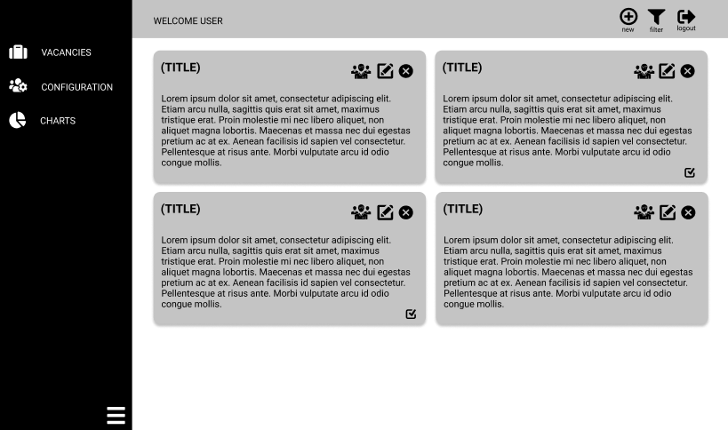
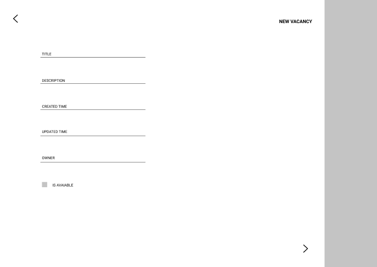
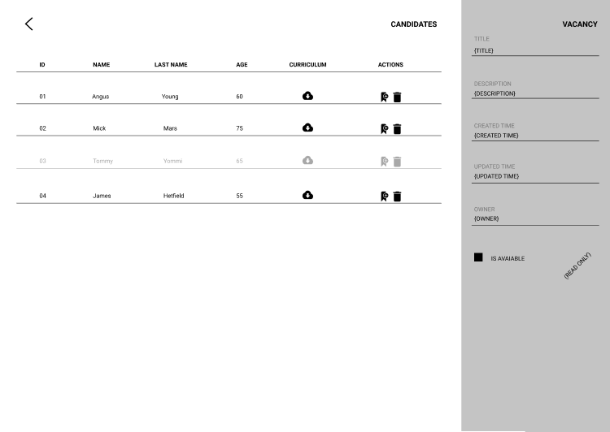

# Description
Vue version of the uSoftware-bayer project developed during my Information Systems degree at São Paulo School of Informatics and Administration

# Technologies Applyed
- Vue.js
- vuex
- vue router
- Typescript
- Webpack
- Babel

# Mockups
All these mockups were developed in Figma

### First Mockup
View where the users can check all vacancies registered into the system and select if he wants to insert a new one or edit or delete an old vacancy.

### Second Mockup
View where the user can insert a new vacancy into the system or edit an old one.

### Third Mockup
View where The user can see all applyers and download their curriculum. The best one can be hired by clicking on the start badge. It's only possible to apply for the jobs opportunities on the mobile app that is in another repository.

# License
uSoftware-bayer-back is under MIT licensed.
